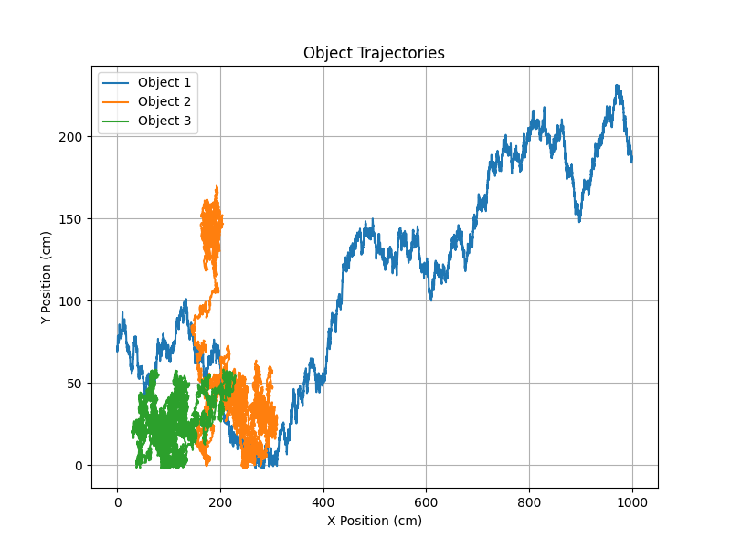
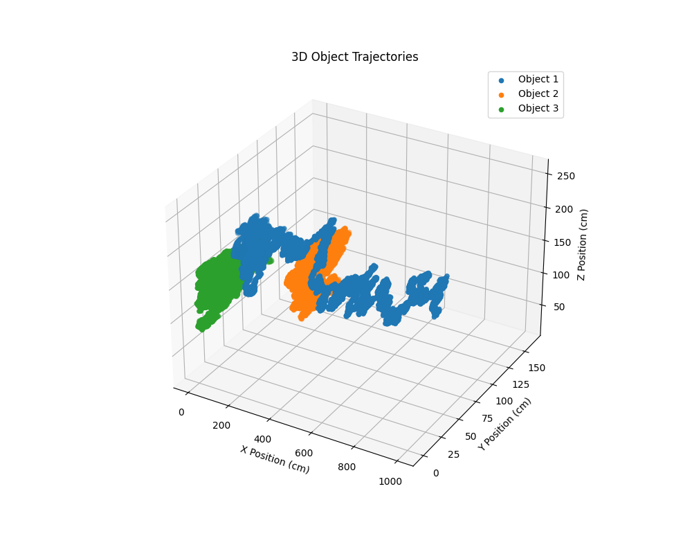

<p align="center">
  
</p>


Zebrafish (*Danio rerio*) are a common model organism for their transparent larval stage, high fecundity, and large library of mutants.


## About this project
 
While working on my master's thesis in Taiwan, I began playing around with Python.

Now I use this repository to demonstrate basic Github management skills and store bioinformatics lessons.

## Prerequisite

Install [Python3](https://www.python.org/downloads/) on your computer.

Enter this into your computer's command line interface (terminal, control panel, etc.) to check the version:

  ```sh
  python --version
  ```

If the first number is not a 3, update to Python3.

## Git Going

Here is an easy way to use a GitHub repository for collaborative, remote development.

### Step 1: Clone the repository

Open the command line interface and run:
  ```sh
  git clone https://github.com/ericodle/Open-Danio
  ```

### Step 2: Navigate to the project directory

  ```sh
  cd Open-Danio
  ```

### Step 3: Create a virtual environment:
Differences between software versions can break your programs and waste your time. 
Therefore, we use a **virtual environment** to ensure software versions on our computer match the versions used by developers when making an open-source project like Open-Danio.


```sh
python3 -m venv env
```

The virtual environment has been created. 
We enter the environment to do our work by using the following command:

```sh
source env/bin/activate
```


### Step 3: Install requirements.txt

Avoid "dependency hell" by installing specific software versions known to work well together.

  ```sh
pip install -r requirements.txt
  ```

### Step 4: Use Open-Danio

This is a simple project containing only three main modules: 2D_trajectory_analysis.py, 3D_trajectory_analysis.py, and novel_tank_dive.py.
These modules are organized in the "src" (source) sub-directory.
There are other directories as well, such as "imgs" (images), "tests", and "notebooks".
Later sections provide a detailed explanation of how to use these elements.

### Step 5: Initialize Git LFS in your repository:

  ```sh
git lfs install
  ```

### Step X: freeze dependencies 

  ```sh
pip freeze > requirements.txt
  ```

## src

### 2D_trajectory_analysis.py

2D_trajectory_analysis.py Python script analyzes 2D trajectories of objects recorded in a CSV file. 
It calculates cumulative path lengths and plots the trajectories in physical units (centimeters). 
The script is designed to work with position data extrapolated from digital video.

```sh
python3 src/2d_trajectory_analysis.py
```

The script will prompt you to enter position data for analysis.
Use the provided synthetic data, or provide your own in a similar format.
A pixels-per-centimeter conversion factor is also required.

```
Enter the path to the CSV file for analysis: tests/2d_trajectory/synthetic_tracking_data_2d.csv
Enter the pixels per centimeter conversion factor: 10
  ```
Output:

```
Object 1: Cumulative Path Length = 304.90 centimeters
Object 2: Cumulative Path Length = 467.15 centimeters
Object 3: Cumulative Path Length = 471.53 centimeters
  ```
<p align="center">
  
</p>

### 3D_trajectory_analysis.py

3D_trajectory_analysis.py is a script for analyzing and plotting 3D object trajectories. 
Similar to the previous script, this one calculates cumulative path lengths for each object in 3D space and plots the trajectories in physical units (centimeters).

```sh
python3 src/3d_trajectory_analysis.py
```

The script will prompt you to enter position data for analysis.
Use the provided synthetic data, or provide your own in a similar format.
A pixels-per-centimeter conversion factor is also required.

```
Enter the path to the CSV file for analysis: tests/3d_trajectory/synthetic_tracking_data_3d.csv            
Enter the pixels per centimeter conversion factor: 10
  ```
Output:

```
Object 1: Cumulative Path Length = 471.96 centimeters
Object 2: Cumulative Path Length = 516.45 centimeters
Object 3: Cumulative Path Length = 517.17 centimeters
  ```
<p align="center">
  
</p>

### novel_tank_dive.py

novel_tank_dive.py is a script for analyzing object movement within different zones and recording the time spent in each zone, as well as counting zone transitions. 
This script is useful for tracking the depth of zebrafish in a tank, which can be a measure of anxiety. 


```sh
python3 src/novel_tank_dive.py
```

The script will prompt you to enter position data for analysis.
Use the provided synthetic data, or provide your own in a similar format.
A video frame rate conversion factor is also required.


```
Enter the path to the CSV file for analysis: tests/novel_tank_dive/synthetic_ntd_data.csv
Enter the frames per second (default is 30): 30
```

Output:

```
Time spent in Zone 0: 213.40 seconds
Number of transitions at Zone 0: 191
Time spent in Zone 1: 76.70 seconds
Number of transitions at Zone 1: 63
Time spent in Zone 2: 33.37 seconds
Number of transitions at Zone 2: 21
Analysis results saved to ntd_analysis_results.csv
```

## tests

Testing was performed on Intel and AMD systems running Linux kernel versions 5.14 and 5.15. 

Scripts used to generate synthetic test data are provided in respective sub-directories.


## notebooks

### notebook 1


## Citing this project


Project which sparked my interest in coding: [Evaluation of the therapeutic effects of dimethyl sulfoxide on FMR1 mutant zebrafish using open-source deep learning software](https://www.google.com/url?sa=t&rct=j&q=&esrc=s&source=web&cd=&ved=2ahUKEwii7qGgzMKDAxVNmK8BHXF2D7sQFnoECAsQAQ&url=http%3A%2F%2Frportal.lib.ntnu.edu.tw%2Fbitstreams%2F2534e275-1fa0-44c6-883a-7024325cdcb1%2Fdownload&usg=AOvVaw0MRYBsjjBFlv8bwUM1aeuR&opi=89978449).

If my amateur masters thesis is somehow beneficial to your work, kindly use the following citation:

```
@masterthesis{odleFMR1,
    title        = {Evaluation of the therapeutic effects of dimethyl sulfoxide on FMR1 mutant zebrafish using open-source deep learning software},
    author       = {Eric Odle},
    year         = {2021},
    month        = {June},
    address      = {Taipei, Taiwan},
    school       = {National Taiwan Normal University},
    type         = {Master's thesis}
}
```

<!-- LICENSE -->
## License

Distributed under the GNU Lesser General Public License. See `LICENSE.txt` for more information.
